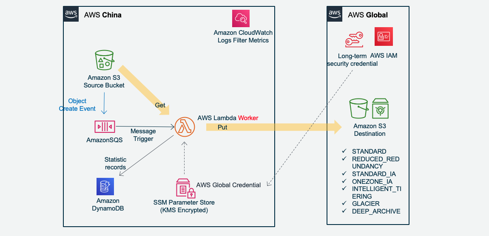
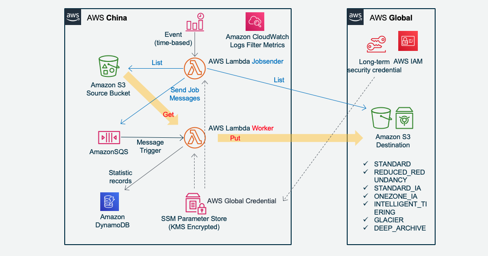

# Amazon S3 MultiThread Resume Migration Serverless Solution  
  
Cluster & Serverless Version 0.98  
  
## Serverless Version  
Amazon EC2 Autoscaling Group Cluster and Serverless AWS Lambda can be deployed together, or seperated used in different senario  
* Transmission between AWS Global and AWS China: Serverless version is suitable for unschedule burst migration.  
* Serverless solution with AWS Lambda and SQS can support large file of tens of GBytes size with unique resumable technique, no worry of 15 mins timeout of Lambda.  
* **Fast and stable**: Multiple nodes X Multiple files/node X Multiple threads/file. Support mass of hugh file concurrently migration. Auto-seperate small file ( including 0 Size) and large file for different procedure.  
* Optional to setup VPC NAT with TCP BBR enable and control EIP to accelerating in some special case. In normal case, e.g. us-east-1, no need for NAT to accelerate.   
* **Reliability**: Amazon SQS queue managed files level jobs, break-point resume trasmission, with timeout protection. Every part will be verified with MD5 after transmission. Single Point of True, final file merging takes the destination S3 as standard, to ensure integrity.  
* **Security**: Transfer in memory, no writing to disk. SSL encryption on transmission. Open source for audit. Leverage IAM role and Lambda Environment Variable(KMS) to store credential Access Key.  
* **Controlable operation**: Job dispatched match the speed of transmission. System capacity predictable. DynamoDB and SQS read/write frequency only related to file numbers, no related to file size. Auto-collect logs to CloudWatch log group. AWS CDK auto deploy.  
* **Elastic cost optimization**: Serverless AWS Lambda only pay for invocation. Support all kind of S3 Storage Class, save long term storage cost.
  
  Serverless Version Architecture  
  Amazon S3 New Create Object trigger transmission:  
  
  
  Jobsender scan Amazon S3 to send jobs:
  
  CloudWatch Event cron trigger Jobsender Lambda every hour
  
### Performance Test:
* us-east-1 AWS Lambda ( No need of NAT) 1310 of files, from 4MB to 1.3GB, totally 50GB. Accomplish transmission to China cn-northwest-1 in 10 minutes. Max Lambda concurrency runtime 153. As file size growing up, transmission spent time is no growing up significantly. Each file is handled by one Lambda runtime, bigger file, will be more threads running concurrently in one runtime. In this case, Lambda setup as 1GB mem, according to your job file size, you can optimize to best cost.

  

* ap-northeast-1 AWS Lambda ( Using VPC NAT Instance with EIP and TCP BBR enabled ). Single file of 80GB video file and 45GB zip file. It takes about from 2 to 6 hours to complete transmit to cn-northwest-1. It is running in ONE Lambda concurrency.  

After one AWS Lambda runtime timeout of 15 minutes, SQS message InvisibleTime timeout also. The message recover to Visible, it trigger another Lambda runtime to fetch part number list from dest. Amazon S3 and continue subsequent parts upload. Here is snapshot of logs of Lambda:   

  
1. AWS Lambda get dest. Amazon S3 upload id list, select the last time of record
2. Try to get part number list from dest. Amazon S3
3. While network disconnect, auto delay and retry
4. Got the part number list from dest. Amazon S3
5. Auto matching the rest part number 
6. Download and upload the rest parts

### Auto Deploy Dashboard  


## CDK auto deploy
Please install AWS CDK and follow instruction to deploy  
https://docs.aws.amazon.com/cdk/latest/guide/getting_started.html   

### 1. Pre-deploy Configure
* Before deploy AWS CDK, please config AWS System Manager Parameter Store manually with this credential:  
Name: s3_migration_credentials   
Type: SecureString  
Tier: Standard  
KMS key source：My current account/alias/aws/ssm  or others you can have  
This s3_migration_credentials is for accessing the account which is not the same as AWS Lambda running account. Config example:  
```
{
  "aws_access_key_id": "your_aws_access_key_id",
  "aws_secret_access_key": "your_aws_secret_access_key",
  "region": "cn-northwest-1"
}
```
Configuration snapshot of s3_migration_credentials:   
  
* Edit app.py in CDK project with your Source and Destination S3 buckets information as example as below:  
```
[{
    "src_bucket": "your_global_bucket_1",
    "src_prefix": "your_prefix",
    "des_bucket": "your_china_bucket_1",
    "des_prefix": "prefix_1"
    }, {
    "src_bucket": "your_global_bucket_2",
    "src_prefix": "your_prefix",
    "des_bucket": "your_china_bucket_2",
    "des_prefix": "prefix_2"
    }]
```
These information will be deployed to System Manager Parameter Store as s3_migration_bucket_para  
* Change your notification email in app.py   
alarm_email = "alarm_your_email@email.com"  

### 2. CDK Auto-deploy
./cdk-serverless  This CDK is written in PYTHON, and will deploy the following resources:  
* Option1: Create S3 Bucket, all new objects in this bucket will be transmitted by Lambda Worker.   
If you want an exist S3 bucekt to trigger SQS/Lambda, you can set the trigger manually. (This is not config in this CDK)
* Option2: If you can setup S3 bucket to trigger SQS/Lambda, e.g. only allow the read access to theses S3 buckets, then this CDK deploy Lambda Jobsender to cron scan these Buckets, compare and create jobs to SQS then trigger Lambda Worker to transmit. You only need to config the buckets information in app.py
* Create Amazon SQS Queue and a related SQS Queue Death Letter Queue. Set InVisibleTime 15 minutes, valid 14 days, 60 Maximum Receives Redrive Policy to DLQ  
* Create Amazon DynamoDB Table for statistic purpose.   
* Upload AWS Lambda code and config environment variable. Config Lambda timeout 15 mintues and 1GB mem. Auto config Lambda role to access the S3, SQS queue and DynamoDB Table under least priviledge.  
There are two Lambda functions, one is Jobsender which is triggered by CloudWatch Cron Event to scan S3 buckets and creat jobs to SQS; The other is Worker, triggered by SQS then to transmit S3 objects.    
* AWS CDK will create a new CloudWatch Dashboard: s3_migrate_serverless to monitor SQS queue and Lambda running status
* Create 3 customized Log Filter for Lambda Log Group. They are to filter Uploading, Downloading, Complete parts Bytes, and statistic them as Lambda traffic and publish to Dashboard. And 2 more filters to catch WARNING and ERROR logs.  
* Ignore List: Jobsender support ignore some objects while comparing bucket. Edit s3_migration_ignore_list.txt in CDK, add the file bucket/key as one file one line. Or use wildcard "*" or "?". E.g.  
```
your_src_bucket/your_exact_key.mp4
your_src_bucket/your_exact_key.*
your_src_bucket/your_*
*.jpg
*/readme.md
```
CDK will deploy this to SSM Parameter Store, you can also change this parameter on s3_migrate_ignore_list after deployed.  

### If Manually Config, notice:  
* Amazon SQS Access Policy to allow Amazon S3 bucket to send message as below, please change the account and bucket in this json:
```json
{
  "Version": "2012-10-17",
  "Id": "arn:aws:sqs:us-east-1:your_account:s3_migrate_file_list/SQSDefaultPolicy",
  "Statement": [
    {
      "Sid": "Sidx",
      "Effect": "Allow",
      "Principal": {
        "Service": "s3.amazonaws.com"
      },
      "Action": "SQS:SendMessage",
      "Resource": "arn:aws:sqs:us-east-1:your_account:s3_migrate_file_list",
      "Condition": {
        "ArnLike": {
          "aws:SourceArn": "arn:aws:s3:::source_bucket"
        }
      }
    }
  ]
}
```
* Create Lambda log group with 3 Log filter, to match below Pattern:
```
Namespace: s3_migrate
Filter name: Downloading-bytes
Pattern: [info, date, sn, p="--->Downloading", bytes, key]
Value: $bytes
default value: 0
Filter name: Uploading-bytes
Pattern: [info, date, sn, p="--->Uploading", bytes, key]
Value: $bytes
default value: 0
Filter name: Complete-bytes
Pattern: [info, date, sn, p="--->Complete", bytes, key]
Value: $bytes
default value: 0
```
So Lambda traffic bytes/min will be emit to CloudWatch Metric for monitoring. Config monitor Statistic: Sum with 1 min.

## Amazon S3 Versioning
### Why S3 Versioning
If not enable S3 Versioning, when transfering a large file, if the file is replaced with a new file but same name at this time, the copy file on destination will be half old half new, integrity is broken. What we used to do is not to change the source file when transfering, or only allow adding new file.  
But there is some case, you have to replace source file, then you can enable S3 versioning feature. So can avoid file integrity broken. This project has supported S3 Versioning, you need to config:
* Source S3 bucket enable Versioning feature
* Source S3 bucket must allow ListBucketVersions and GetObjectVersion in bucket policy
* Config below application parameters:

### The parameter for S3 Versioning
* JobsenderCompareVersionId(True/False):  
Default: False  
True means: When Jobsender comparing S3 buckets, get versionId from source buckets. The destination S3 bucket versionId are saved in DynamoDB when start transfer every object. Jobsender will get destination versionId list from DynamoDB for comparing. The SQS Job message will contain versionId.  

* UpdateVersionId(True/False):  
Default: False  
True means: Before Work start transfer a object, it update the versionId this the Job message. This feature is for the case that Jobsender has not sent versionId, but you still need to enable versionId for integrity protection.  

* GetObjectWithVersionId(True/False):  
Default: False  
True means: When Worker get object from source bucket, get with specified versionId. If set the switch to False, it will get the lastest version of the object.  
  
For Cluster version, the above parameters are in s3_migration_config.ini  
For Serverless version, the above parameters are in Lambda Environment Variable of Jobsender and Worker.  

### Senario of choosing parameters
* S3 new object trigger SQS Jobs:  
```
  UpdateVersionId = False  
  GetObjectWithVersionId = True   
```
  In this S3 trigger SQS case, when S3 Versioning enable, the SQS message contains versionId. Worker just follow this versionId to get source S3 bucket. If broken while transfering and recovering, it still get object with the same versionId.  
  If you don't have the GetObjectVersion permission, you need to set these parameters to False, otherwise get object will fail because of AccessDenied.

* Jobsender compare S3 and send SQS Jobs. Here are two purposes:  
  
  1. Integrity: For fully ensure even file is replaced while transfering, the file is still a complete file, not half new half old.  
  ```
  JobsenderCompareVersionId = False  
  UpdateVersionId = True  
  GetObjectWithVersionId = True  
  ```
  For better performance, not to compare versionId in Jobsender, so send SQS message with versionId 'null'. And before Worker get object with versionId, it get the real versionId from source S3 and save to DynamoDB. When this object transfer complete, it will check the versionId matching again. 

  2. Integrity and consistency: For compare source/destination S3 buckets existing files size and also compare version, and fully ensure even file is replaced while transfering, the file is still a complete file, not half new half old.  
  ```
  JobsenderCompareVersionId = True  
  UpdateVersionId = False  
  GetObjectWithVersionId = True  
  ```
  Jobsender compare versionId in source bucket and in DynamoDB. Send SQS message with real versionId. Worker will follow this versioinId to get object.

* For case that no need to compare version, and the file will not be replaced while transfering, or you don't have GetObjectVersion permission source bucket. Just set the three parameters to False. (Default)

### Why not enable all by defult?  
* Performance: Get the source versionId list will spend much more time than just List objects. If you have lots of objects (such as more than 10K), and you are using Lambda as Jobsender, it might exceed the 15 minutes limit.  

* Permission: Not every bucket permits to GetObjectVersion. Some bucket might open read for GetObject, but not GetObjectVersion for you, e.g. some Open Data Set, even enabled Versioning.

## Limitation and Notice: 
* Required memory = concurrency * ChunckSize. For the file < 50GB, ChunckSize is 5MB. For the file >50GB, ChunkSize will be auto change to Size/10000  
So for example is file average Size is 500GB , ChunckSize will be auto change to 50MB, and the default concurrency setting 5 File x 10 Concurrency/File = 50. So required 50 x 50MB = 2.5GB memory to run in EC2 or Lambda.  
If you need to increase the concurrency, can change it in config, but remember provision related memory for EC2 or Lambda.  

* Don't change the chunksize while start data copying.  

* To delete the resources only need one command: cdk destroy  
But you need to delete these resources manually: DynamoDB, CloudWatch Log Group, new created S3 bucket 


## License

This library is licensed under the MIT-0 License. See the LICENSE file.
